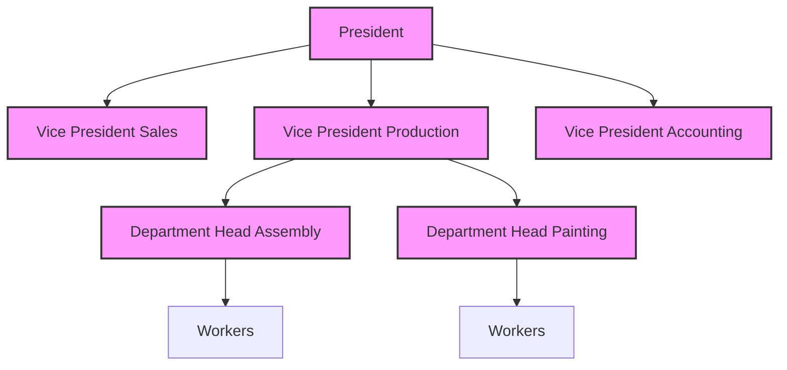
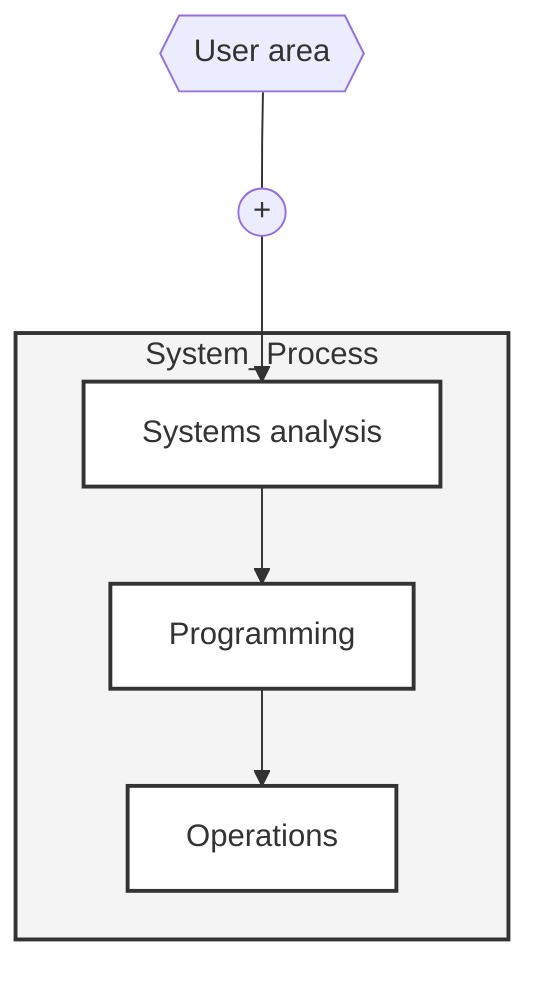
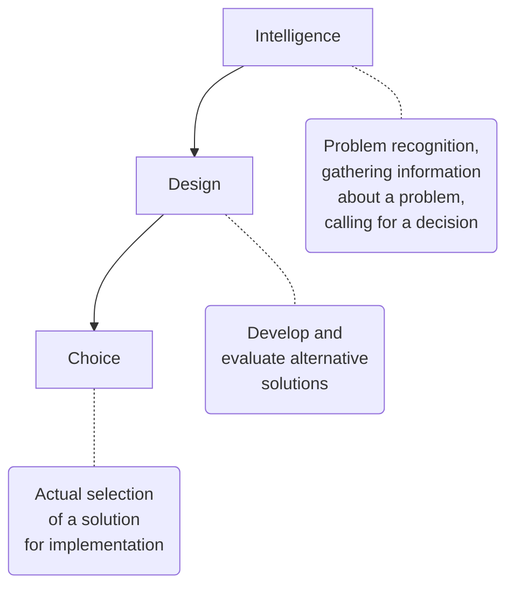
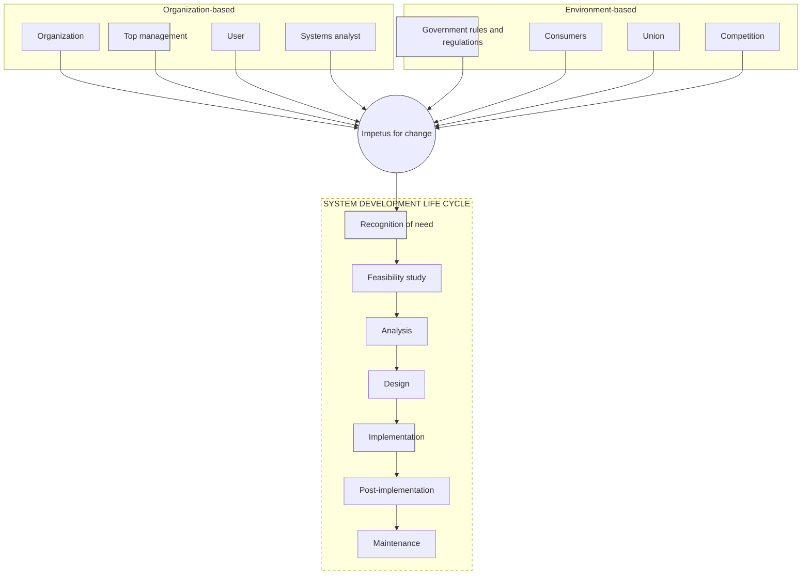
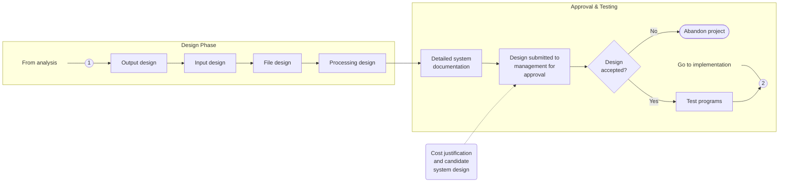
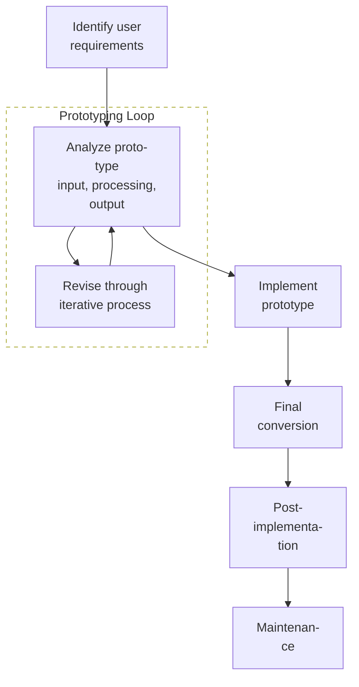

# System Analysis and Design Notes
## Definition
### System 
The term system is derived from the greek word _systema_ which means an organized relationship among functioning units or components.
**OR** 
A system is an _orderly grouping_ of interdependent _components_ linked together according to a plan to acieve a specific objective.

**A system has three basic implications:**
1. A system must be designed to achieve a predetermined objective.
2. Interrelationships and interdependence must exist among the components.
3. The objectives of the organization as a whole have a higher priority than the objectives of its subsystems

## Characteristics
`OIIIC`
**Organization**:
1. _Organization_ implies structure and order. It is the arrangement of components that helps to achieve objectives.
2. In the design of a business system, the hierarchial relationships starting with the president on top and leading down to blue-collar workers represents the organization structure.
3. In the design of a computer system, the input devices, a _Central Processing Unit_, output devices, and one or more storage units, when linked together, they work as a whole system for processing information.

**Interaction**
1. _Interaction_ refers to the manner in which each component functions with other components of the system.
2. For example purchasing must interact with production, advertisement must interact with sales, .._etc_.
3. For another example the _Central Processing Unit_ must interact with the input device to solve a problem.

**Interdependence**:
1. _Interdependence_ means that the parts of the organization or computer system depend on one another and they are linked together according to a plan.
2. The output of one subsystem is the required input of another system.
3. No subsystem can function in isolation.

**Integration**:
1. _Integration_ refers to the holism of the systems.
2. Integration is concerned with how a system is tied together.
3. It is means that if the parts of the system work together within the system even though each part performs a unique function.
4. Succesful integration will produce a _synergistic effect_ and greater total impact than if each component works seperately.
5. It ensures data flow between modules is smooth and without any conflicts or redundancy, when they run together.

**Central Objective**:
1. _Central Objective_ is the goal or set of goals towards which the system is determined to work to produce an ouput that has value to its user; together, interdependently, overall.
2. Objectives might be real (towards earning profit), or stated (formal).
3. If there is no clear objective, the system would be just a pile of modules.

## Elements and Types of system
### Outputs and Inputs:
1. The major objective of a system is to produce an ouput that has value to its user.
2. Independent of the nature of the output, it must be in line with the expectations of the user.
3. _Inputs_ are the elements (material, human resourses, information) that _enter the system for processing_.
4. _Output_ is the _outcome of processing_.

### Processor(s):
1. The _processor_ is the element of a system that involves the actual transformation of input into output.
2. It is the operational component of the system.
3. Processors may modify the input totally or partially, depending on the specification of the output.

### Control:
1. The _control_ element guides the system.
2. It is the decision-making subsystem that controls the pattern of activities governing input, processing and output.
3. For example, in an organization, management as a decision-making body controls the _inflow_, _handling_ and _outflow_ of activities that affect the welfare of the business.

### Feedback:
1. Control in a dynamic system is achieved by _feedback_.
2. Feedback measures output against a standard in some form of cybernetic procedure that includes _communication_ and _control_. 
3. Feedback may be _positive_ or _negative, routine_ or _informational_.
4. Positive feedback refinforces the performance of the system. It is routine in nature.
5. Negative feedback generlly provides the controller with information for action.

### Environment:
1. The _environment_ is the "suprasystem" within which an organization operates.
2. It is a source of external elements that impinge on the system.
3. It often determines how the system should function.
4. In a business, the environment consists of vendors, competitors and others. They man provide constraints and eventually, influence the actual performance of the business.

### Boundaries and Interface:
1. A system should be defined by its _boundaries_ - the limits that identify its components, processes, and interrelationships when it interfaces with another system.
2. Each system has its boundaries which define its sphere of influence and control.
3. For example a teller system in a commmercial bank is restricted to the deposits, withdrawals, and related activities.

### Types of System
1. Physical or Abstract
2. Open or Closed
3. "Man-made" Information Systems

**Physical or Abstract**:
1. _Physical_ systems are _tangible_ entities that may be _static_ or _dynamic_ in operation. For example the _static_ parts of a computer center are chairs, desks, offices are needed to operate the computers. The _dynamic_ part of a computer center is a programmable computer. The data, output and programs change according to the user's needs.
2. _Abstract_ systems are conceptual or non-physical entities. They may be as straightforward as a formulas for the relationships among sets or models.
3. A _model_ is a representation of a real or a planned system. It helps the system analyst to visualize the system.

**Open or Closed System**
1. An _open_ system has many interfaces with its environment.
2. It permits interaction across its boundary.
3. It recieves inputs from and delivers outputs to the environment.
4. An Information system falls to this category.
5. A _closed_ system is isolated from its environment.
6. In reality it is rare.

**Characteristics of an Open System:**
1. **Input from Outside:** Open systems are self-adjusting and self-regulating. When functioning normally, an open system reaches a _steady state_.
2. **Entropy:** Open systems resist entrpy by seeking new inputs or modifying the processes to return to a steady state.
3. **Process, Outputs and Cycles:** Open Systems produce useful output and operate in cycles, following a continuous flow path.
4. **Differentiation:** Opem systems have a tendency for greater level of speicalization of function and a greater differentiation in their functions.
5. **Equifinality:** The goals are achieved through differing courses of actions and a variety of paths.

**Man-Made Information Systems**
1. An _Information-System_ may be defined as a set of devices, procedures and operating systems designed around user-based criteria to produce information and communicate it to the user for planning, control and performance.
2. They are categorized as _formal_, _informal_ and _computer-based_ systems.

**Formal Information System**
1. A formal information system is based on the organization represented by the _organization chart_. The chart is a map of _position and their authority_ relationships indicated by boxes and connected by straight lines.
2. The formal information system is a power structure designed to achieve company goals.
3. It is concerned with pattern of authority, communication and work flow.
4. Information is formally dissemented in instructions, memos or reports from top management to the intended user.
5. This structure allows _feedback_ up the chain of command for follow-up.
6. _Policies_ are generalizations that specify what an organization ought to do. They are translated into _directives, rules and regulations_.
7. _Policies_ are transmitted to lower lever management for implementation.
8. The output represents employee performance.

**Categories of Information related to the Manegarial Levels**
1. **Strategic Information**: It relates to long-range planning policies that are of direct interest **upper management**. _Unstructured Information is Processed_. Information such as population growth, tends in financial invertment and human resources changes would be of interest to the  top company officials who are responsible for developing policiesand determining low-range goals. This type of information is achieved with the aid of _Decision-Control_Systems (DSS)_.
2. **Managerial Information**: It is of direct use to the **middle management** and **department heads** for implementation and control. For example, sales analysis, cassh-flow projections, and annual financial statements. This information is of use to short-term and intermediate-range planning (months). It is maintained with the aid of _Mangement Information Systems(MIS)_.
3. **Operational Information:** It is the short term daily information used to operate departments and enforce the day-to-day rules and regulations of the business. _Structured Information is Processed_. Examples are daily employee absence sheets, overdue purchase orders and currect stocks available for sale. Operational Information is established by _Data Processing Systems(DPS)_.

**Informal Information Systems**
1. It is an employee-based system designed to meet _personnel_ and _vocational_ needs. and help to _solve work related problems_.
2. It also funnels information upwards through indirect channels.
3. It is a useful system as it workd within the boundaries of the system and its stated policies.
4. The analyst should know the chain of command, the _power-authority-influence_ network and how decisions are made to get a feel for how much support can be expected for a prospective installation.
5. Employee cooperation and participation are crucial in preventing sabotage and training users; A proper interface for employee-based channels would decide the success or failure of the system.

**Computer-based Information Systems:**
    The computer is now a required source of information. System analysis rely heavily on computer for handling business applications.

**1. Management Information Systems (MIS)**
1. _Low-level_ management needs detailed internal information to make _day-to-day_, relatively structured and control decisions.
2. _Higher-level_ management, for whom _long-range objectives_ are the primary concern, needs summarized information from a variety of sources to attain goals.
3. In both cases, management action is based on information that is accurate, relevant, complete, concise and timely which is satisfied by MIS.
4. MIS is a person-machine system and a highly integrated grounping of information processing functions designed to provide management with a comprehensive picture of specific operations.
5. It is a combination of Information systems operating in real time, handling inquiries as quicklly as they are recieved. It is available early enough to affect a decision.
6. Operationally it provides operations for file definition, file maintinence, updation, transaction and inquiry processing, and one or more databses linked to an organizational database.
7. Within MIS, a single transaction can simultaneously update all the related data files in the system and also being redundant.
8. The database is a **key element of an MIS** which is a non-redundant collection of interrelated data items that can be processed through application programs and available to many users. _Following are some **advantages** of DBMS:_
    * Processing time and the number of programs written are substantially reduced.
    * All applications share centralized file.
    * Storage space duplication is eliminated.
    * Data are stored once in the data base and are easily accessible when needed.
    _Following are some **drawbacks**:_
    * Cost of specialized personnel is more.
    * There is a need to protect the sensitive data from unauthorized access.
9. Following are the users of MIS:
    * _Middle and Top level managements_ use MIS for _preparing forecasts_, _special requests for analysis_, _long-range plans_ and _periodic plans_.
    * _Operational managers_ use MIS primarily for _short-range planning_ and _exception reports_.
    * The _support staff_ finds MIS useful for the _special analysis_ of informationand reports to help management in planning and control.
10. Once the information enters the system, the information is no longer owned by the initiating user but becomes available to all the authorized users.
11. Some disadvantages of the MIS are:
     * Most MIS reports are historic and dated.
     * Many installations have databases that are not in line with user's requirements i.e, many MIS environments have not been congruent to the real world of the user.
     * Inadequate or incomplete update of the database jeopardizes the reliability for all users.
     * A major problem encountered in MIS designed in MIS design is encountered in MIS design is obtaining the acceptance and support of those who will interface with the system.
     * In both understanding of technology or human behaviour, the analyst faces the challenge of selling change to the right people for a successful installation.
     * It provides limited support to _top-level_ management for decision making.

**2. Decision Support System (DSS)**
1. DSS advances the capabilities of MIS by assisting management in making decisions.
2. It is a continually evolving model that relies heavily on _operational research_.
3. **"Decision"** – emphasizes decision making in problem situations; not in formation processing, retrieval or reporting.
4. **"Support"** – Requires computer-aided decision situations with enough _structure_ to permit computer support.
5. **"System"** – Accentuates the integrated nature of problem solving, suggesting a combined _man, machine and decision_ environment.
6. The role of the analyst:
    * to look at the existing DSS packages, their attributes, capabilities, and design capabilities, and design considerations, consider how do they look _different_ from MIS design.
    * to learn more about the methodology needed to provide a proper fit between DSS as a _future-oriented system_.
    * to remain updated about new features of DSS as it is thee wave of the future.
7. There are three phases of DSS:
    * The _intelligence_ phase of decision making involves the awareness of a problem at a symptomatic level. It requires a closer look at the problem and  a thorough evaluation of the variables and their relationships. It accomplishes the _root cause_ of the problem. A DSS can provide intelligence through information retrieval and statistical packages.
    * The _design_ phase of a decision making focuses on the evaluation of decision alternatives. During this phase, computer based deterministic models may be used for desicion design.
    * The output of the model is the basis for the _choice_ phase of decision making.
   

## System Development Life Cycle
### SDLC
A candidate system has a life cyclejust like a living system or a new product. System analysis and design are keyed to System Developement Life Cycle.

**1. Recognition of Need - What is the Problem:**
1. One must know what the problem is before it can be solved.
2. The basis for a candidate system is recognition of a _need for improving a system or a procedure_.
3. This need leads to a _preliminary survey_ or an _initial invertigation_ to determine whether an alternative system can solve the problem.
4. It involves looking into the duplication of efforts, bottlenecks, inefficient existing procedures, or whether  parts of the existing system would be candidates for computerization.
5. If the problem is serious enough, management may want an _analyst_ to look at it.
6. The analyst is hired from the environment and his first task is to _prepare a statement specifying the objectives and objectives of the system_.
7. He then reviews them with the users.

A system may fail OR recieve an _impetus_ for change based on following factors:
1. The risks and potential returns.
2. Management's bias towards the user.
3. Funds available and the costs.
4. Priorities of other projects in the firm.
5. The persuasive ability of the user for a change.

**2. Feasibility Study:**
1. Depending on the results of the initial investigation, the survey is expanded to a more detailed feasibility study.
2. _Feasibility Study is a test of a system proposal according to its workability impact on the organization, ability to meet user needs, and effective use of resourceses._
3. It focusses on three major questions:
     1. What are the user's demonstrable needs and how does a candidate system meet them?
     2. What resources are available for given candidate systems? Is the problem worth solving?
     3. What are the likely impact of the candidate system on the organization? How well does it fit with the organization's master MIS plan?
    The question revolve around investigation and evaluation of the problem, description of candidate systems and choosing the best system of of them.
4. The _objective_ of a feasibility study is not to solve the problem but to acquire a sense of its scope.
5. The problem definition is crystallized and aspects of the problem to be included in the system are determined.
6. _Costs and Benefits Analysis (CBA)_ is done with accuracy and depth.
7. The _result_ of the feasibility stuudy is a _report_ consisting:
    1. _Statement of the problem:_ A carefully worded statement of the problem that led to analysis.
    2. _Summary of findings and recommendations:_ A list of major findings and recommendations of the study ideal for the user who requires a quick access to the results of the analysis.
    3. _Details of findings:_ An outline of the methods and procedures under-taken by the existing system, followed by coverage of the objectives and procedures of the candidate system. It  also includes the discussion of output reports, CBA and file structures of it.
    5. _Recommendations and conclusions:_ It includes specific recommendations regarding the candidate system, including personnel assignments, costs, project schedules and target dates.
8. After the report is reviewed by the management, it becomes a formal agreement that paves the way for the actual design and implementation.
9. If a project is not feasible, it is discarded by the management.

**3. Analysis:**
1. Analysis is a detailed study of the various operations performed by a system and their relationships within and outside of the system.
2. A _key question_ is: "What must be done to solve the problem?".
3. It defines the boundaries of the system and determines whether a candidate system should consider other related systems.
4. During analysis, data are collected on the available files, decision points and transactions handled by the present system.
5. Some logical system models and tools such as _data-flow diagrams, interviews, on-site observations and questionnaires_ are used in analysis.
6. Training, experieence and common sense are required for collection of the information needed for analysis.
7. Once analysis is done, the analyst has a firm understanding of what is to be done.

**4. Design:**
1. The most _creative and challenging_ phase of SDLC is system design.
2. The term _design_ describes a final system and the process by which it is developed.
3. It refers to the technical specifications (ambigous to engineer's blueprint for a construction to be done) tht will be applied in inplementing the candidate system.
4. It involves the following steps:
    1. The first step is to determine how the output is to be produced and in what format.
    2. Input data and master files for the database have to be designed to meet the requirements of the processed output.
    3. The details related to justification of the system and estimate of the impact of the candidate system on the user and the organization are documented and evaluated by management as a step towards implementation.
    4. The final report prior to the implementation phase involves process flowcharts, record layouts, report layouts and a workable plan for implementing the candidate system.
    5. The programmers write the programs according to the design.
    6. The analyst carries the follwoing procedures:
         1. Operating procedures and documentation must be completed.
         2. Security and auditing procedures are also developed.

**5. Implementation:**
1. The _implementation phase_ is primarily concerned with user training, site preparation and file conversion and if the candidate system is linked to the terminas or remote sites, the telecommunication network tests.
2. During the final testing, _user acceptace_ is tested, followed by _user training_.

3. Depending on the nature of the system, extensive user training may be required.
4. Once the programmers are avaliable, test data are provided for testing for each module. If successful, the program is then run on "live" data. Otherwise a diagnostic procedure is used to locate and correct errors in the program.
5. The implementation can be done in any one mode:
    1. _Direct Cutover_: Switch off the old system and turn on the new one all at once (fast but risky). 
    2. _Parallel_: Run old and new systems together for a time, ensuring the new works before retiring the old (safer but resource-heavy). 
    3. _Pilot_: Roll out the new system to a small user group first, then expand if successful (controlled approach).

**6. Post-Implementation and Maintainance:**
1. There is an ageing process that requires periodic _maintainence_ of harware and software.
2. If the new information is inconsistent with the design specifications, then changes have to be made in the software.
3. Hardware also requires periodic maintainance to keep in tune with design specifications.
4. The importance of maintainance is to continue to bring new systems to standard by integrating patches and version control.

**Disadvantages:**
1. The SDLC takes too long; lengthy development frustrates the user.
2. The right system is rarely developed at the first time.
3. Analysis seems to be bogged down with tedious methodologies for developing systems.
4. The users are expected to define their information requirements rightly; It usually turns out that _what users ask for is not what they want, and what they want is not what they need._
5. Often referred to as _paralysis by analysys_.

### Prototyping
1. Prototyping is an advanced substitute to the SDLC.
2. _Prototyping_ recognizes problems od  cognitive style uses advanced computer technology.
3. It advocates building simple system through _trial and error_ and refining it through an _iterative process_.
4. The basic steps are:
    1. Identify the user's information and operating requirements.
    2. Develop a working prototype that focusses on only the most important functions, using a basic database
    3. Allow the user to use the prototype, discuss requested changes and implement the most important changes.
    4. Repeat the next version of the prototype with further changes incorporated until the system meets user requirements.
**Benefits of prototyping:**
1. Protoyping insures shorter development time.
2. It implies more accurate user requirements.
3. It enforces greater participation of the user in the process.
4. It allows more support to the process.

## Role of System Analyst
An analyst must possess various skills to effectively carry out the job. 

_Technical Skills:_
They focus on procedures and techniques for operational analysis, system analysis and computer science.
_1. Creativity:_ Helping users model ideas into concrete plans and developing candidate systems to match user requirements.
_2. Problem Solving:_ Reducing problems to their elemental levels for analysis for development of alternative solutions to a given problem, and delineating the pros and cons of the candidate systems.
_3. Project Management:_ Scheduling, performing well under time constraints, coordinating team effors and managing costs and expenditures.
_4. Dynamic Interface:_ Blending technical and non-technical considerations in functional specifications and general design.
_5. Questioning attitude and enquiring mind:_ Knowing the what, when, why, who and how a system works.
_6. Knowledge of the basics of the computer and the business function._

_Interpersonal Skills:_
1. _Communication:_
    1. Having the ability to articulate and speak the language of the user.
    2. Having the ability to communicate with multiple levels of the management.
    3. Having the ability to communicating without fear of being identified and openly.
2. _Understanding:_
    1. Identifying problems and assessing their ramifications, having a grasp of company goals and objectives.
    2. Showing sesitivity to the impact pf the system to people at work.
3. _Teaching_:
    1. Educating people in use of computer systems.
    2. Selling the system to the users.
    3. Giving support when needed.
4. _Selling_: Selling ideas and promoting innovations in problem solving using computers.

_Academic and Personal Qualifications:_
1. A background in systems theory and organizational behaviour.
2. Familiarity with the makeup and inner workings of major application areas such as financial accounting, personnel administration, operational management, model building and production control.
3. Competence in system tools and methodologies and a practical knowledge of one or more coding languages and database languages.
4. Experience in hardware and software specifications, which is important in selection.

_The multifaceted role of system analyst:_
1. _Change agent:_
   1. The analyst is viewed as an agent of change.
   2. A candidate system is designed to introduce change and reorientation in how the user organization handles information or makes decisions.
   3. It is important then, that the change is accepted by the user.
   4. The knowledge that people inherently resist change should alert us to carefully plan, monitor and implement change into user's domain.
   5. A system analyst may select various styles to introduce a change to the user organization - persuader, catalyst, confronter or imposter.
   6. An analyst should achieve acceptance of the system with a minimum of resistance.

2. _Investigator and monitor:_
    1. The analyst pieces together the information gathered to determine why the present system does not work well and what changes will correct the problem.
    2. In one respect, this work is similar to that of an _investigator_ - extracting the real problems from an existing system and solving them by creating information systems which uncover previously unknown trends which benefit the organization.
    3. The analyst undertakes and succesfully completes the project. He _monitors_ programs in relation to time, cost and quality.

3. _Architect:_
    1. The architect's primary function as being a link between the client's abstract design requirements and the contractor's detailed building plan maybe compared to the analyst's role as a link betweenm user's logical requirements and detailed physical design of condidate systems.
    2. It aids users in formalizing abstract ideas and provide details to build end product - the candidate system.

4. _Psychologist:_
    1. In SAD, systems are built around people.
    2. The analyst plays a role of a psychologist in that.
    3. He reaches people, interprets their thoughts, address their behaviour and draws conclusions from the interactions.
    4. Understanding interfunctional relationships is important for better functioning of the management.
    5. The art of listening is important in evaluating responses and feedback.

5. _Salesperson:_
    1. Sales skills and persuasiveness for selling the change are crucial just equal to initiating the change for the success of the system.
    2. Selling the system actually takes place at each step in system life cycle.

6. _Motivator:_
    1. A candidate system must be well designed and acceptable to the user.
    2. System acceptance is achieved by user participation in its development, effective user training and proper motivation to use the system.
    3. The analyst's role becomes most obvious during both the initiation and selling periods.
    4. Being able to motivate the users to use the new system taxes analyst's abilities to maintain that pace.

7. _Politician:_
    1. In implementing a candidate system, the analyst tries to appease all parties involved.
    2. Diplomacy and finesse in dealing with people can improve acceptance of the system.
    3. The analyst must have an immense support of the users' staff just like the politicians need their constituency's support. He acts as a carrier of change through computerization.

8. _Conflict Resolver:_
    1. The role of analyst requires a vast network of people's ideas and integrating them into a _systemeering_ process design.
    2. The analyst should be able to make a commitment up to an extend, to avoid future conflicts.
    3. The conflicts in both technical and behaviroul factors in system development has lead the organizations to integrate new methodologies to ensure conflict free success of the candidate system.
   
_The Role of the System analyst in MIS_
1. _Administration:_
    1. User-Liason handles the changing needs of the user and user-system relationship.
    2. Long-range planning includes personnel selection, recruitment, application developmentand planning for anticipated changes in hardware and software.
    3. Budget planning and control of the entire MIS division.
    4. Personnel administration and training for upgrading employee skills.
    
2. _System analysis and design:_
    1. It maybe oriented as a project oriented, pool oriented or functional oriented.
    2. In a _project-oriented_ arrangement is a team of analysts to work on a project.
    3. They report to a project leader.
    4. This is great for limited, specific missions but the team usually breaks up after the job is done.
    5. In a _pool-oriented_ arrangement,  analysts hang out in a general "pool" and are loaned out to projects as needed.
    6. Once they finish a job, they hop back into the pool.
    7. This makes sure no one is sitting around doing nothing.
    8. In a _functional arrangement_, analysts are assigned to specific business departments (like Marketing or Production) and report to _that_ department’s manager.
    9. This is awesome for ensuring the users really get what they need.

3. _Programming:_
    1. It creates the actual code based on three areas: Applications, Software (like compilers), and Maintenance.
    2. The text notes that in many applications, programmers are placed on the same project team _with_ the analysts to make sure the design is built correctly.
    3. Like the analysts, programmers can be organized in a _Pool_ (reporting to a supervisor) or a _Team_ (reporting to a project leader).

4. _Operations_
    1. This is the "engine room" layer that keeps the daily grind running.
    2. They handle job scheduling, supplies inventory, and the data library.
    3. Crucially, this domain coordinates directly with _Systems Design_ and Programming to follow a master plan so everything runs on schedule.

